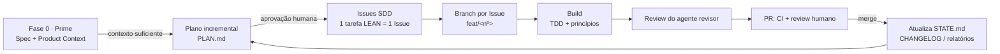

<!-- markdownlint-disable MD041 -->
# Orion Harness

[](https://github.com/isaiane/OrionHarness/actions/workflows/ci.yml)

> Template base reutilizável para inicializar projetos desenvolvidos com agentes de IA,
> inspirado nos princípios de **Effective Harnesses for Long-Running Agents**.

O Orion Harness é uma fundação de **padrões, processos, artefatos e guardrails** pensada para
reduzir os três maiores riscos de projetos conduzidos por agentes ao longo do tempo:
**regressão**, **perda de contexto** e **inconsistência**. Clone-o como ponto de partida de
qualquer projeto novo e ganhe, de imediato, governança, qualidade e capacidade de evolução de
longo prazo.

Este repositório é um **GitHub template repository**: use o botão **"Use this template"** para
gerar um novo projeto independente a partir desta base.

## Princípios

- **Universal e poliglota.** Os padrões são agnósticos de linguagem; ferramentas concretas vêm
  como *presets* opt-in por stack (web/full-stack, APIs/backend, mobile/app).
- **Spec-Driven.** Toda evolução nasce de um plano incremental de tarefas pequenas, independentes
  e validáveis (LEAN). Cada tarefa vira uma **Issue autossuficiente** que carrega contexto
  suficiente para um agente retomar o trabalho no futuro sem depender da conversa original.
- **Contexto preservado em camadas.** A memória do projeto vive em artefatos versionados, não na
  janela de contexto de uma sessão.
- **Governança com gates humanos.** O agente propõe; o humano aprova decisões-chave (plano,
  decisões arquiteturais, merge).
- **Fundamentos de engenharia como guardrail.** SOLID, DDD estratégico, API-First, TDD, 12-Factor
  e KISS/YAGNI/DRY são guia obrigatório, na **postura lean/flat por padrão**; Clean
  Architecture/Hexagonal e event-driven são **opt-in** com justificativa — rigor proporcional ao
  tamanho da tarefa.
- **Segurança por design e modelo de confiança.** AuthN/AuthZ, gestão de segredos, proteção de
  dados, auditoria, rastreabilidade e isolamento entre contextos são fundações arquiteturais; um
  modelo de confiança (T0–T4) define o que é automatizável e o que exige aprovação humana. Ver
  [`docs/architecture/foundations.md`](docs/architecture/foundations.md).
- **UI governada por Design System** _(projetos com interface)_. O agente compõe telas apenas com
  Design Tokens e componentes aprovados, usando o catálogo (ex.: Storybook) como grounding — nunca
  gera UI livre. Ver [`docs/architecture/ui-agent-harness.md`](docs/architecture/ui-agent-harness.md).
- **Data-First.** O uso real do produto deve ser observável: nenhuma funcionalidade é implementada
  sem responder, na SPEC, como saberemos que está sendo usada, se gerou o resultado esperado e
  quais eventos/métricas capturar.

## Como funciona (ciclo de evolução)



O agente opera como **orquestrador executando um pipeline de fases** —
`prime → initialize → plan → spec → build → review → ship` — com gates de aprovação humana entre as
etapas-chave. A **Fase 0 (Prime)** garante que existe contexto suficiente (Spec + Product Context)
antes de qualquer planejamento; o **Initialize** é um bootstrap opcional/one-time do ambiente
executável (ver `AGENTS.md` §2.2).

## Estrutura do repositório

```text
.
├── AGENTS.md              # Constituição do agente: regras, pipeline, gates, convenções
├── CLAUDE.md              # Ponteiro para AGENTS.md (compat. com ferramentas)
├── README.md
├── LICENSE
├── SECURITY.md            # Política de segurança e reporte de vulnerabilidades
├── CODEOWNERS
├── .editorconfig
├── .env.example           # Variáveis de ambiente (segredos ficam fora do repo)
├── .pre-commit-config.yaml
├── commitlint.config.js
├── .gitignore
├── presets/               # Presets opt-in por stack (TypeScript, Python, Mobile)
├── PLAN.md                # Mapa de épicos do plano incremental
├── STATE.md               # Índice leve: épico/Issues ativas e fase atual
├── MEMORY.md              # Índice navegável de toda a memória do projeto
├── CHANGELOG.md           # Histórico de mudanças
├── docs/                  # Índice em docs/README.md
│   ├── architecture/      # Fundações: Security by Design, modelo de confiança, padrões AI-First
│   ├── product/           # Product Context + Spec + discovery — insumo da Fase 0 (Prime)
│   ├── decisions/         # ADRs — Architecture Decision Records (template + ADR-0001)
│   ├── plans/             # Detalhamento por épico
│   ├── runbooks/          # Operação: proteção de main, Projects, segredos
│   ├── testing-strategy.md
│   ├── agent-reviewer-checklist.md
│   ├── observability.md
│   └── getting-started.md # Guia de reuso (Use this template)
├── CONTRIBUTING.md        # Fluxo de contribuição, branches, commits, PRs
└── .github/
    ├── ISSUE_TEMPLATE/    # Template de Issue Spec-Driven (SDD) + config
    ├── PULL_REQUEST_TEMPLATE.md
    ├── labels.yml         # Convenção de labels
    ├── dependabot.yml
    └── workflows/         # CI (lint/test/build + secret scan) e release opcional
```

> Veja o progresso e o escopo de cada fase em `PLAN.md`.

## Começando um projeto novo

1. Clique em **"Use this template"** e crie seu repositório.
2. Siga o guia [`docs/getting-started.md`](docs/getting-started.md): personalizar a base, ativar
   guardrails, configurar o GitHub e rodar a **Fase 0 (Prime)**.
3. Leia [`AGENTS.md`](AGENTS.md) por inteiro — é a constituição que governa o agente.
4. Preencha o contexto em `docs/product/` (gate **G0**) e peça ao agente um **plano incremental**
   em `PLAN.md`.
5. Aprove o plano. As tarefas viram **Issues SDD** e o ciclo de evolução começa.

## Documentação

O índice completo está em [`docs/README.md`](docs/README.md). Pontos de entrada principais:
[`AGENTS.md`](AGENTS.md) (constituição), [`docs/architecture/foundations.md`](docs/architecture/foundations.md)
(fundações), [`MEMORY.md`](MEMORY.md) (índice de memória) e
[`docs/getting-started.md`](docs/getting-started.md) (reuso).

## Licença

[MIT](LICENSE).
