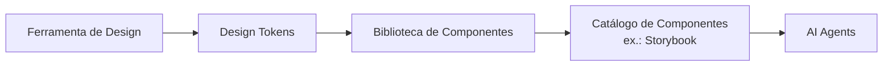

# UI Agent Harness — Orion Harness

> **Aplicabilidade:** apenas projetos com interface gráfica (web ou mobile). Projetos sem UI
> ignoram este documento. Camada **L0** (governança); mudanças exigem ADR (gate G2). Resumo e
> ganchos em [`AGENTS.md`](../../AGENTS.md) §11.1.

## Princípio

O **Design System é a fonte de verdade da interface.** Agentes **não geram UI livremente** nem
criam componentes arbitrários. Toda interface é composta **exclusivamente** a partir de Design
Tokens, componentes, padrões e estados **aprovados**.

## Pipeline conceitual

O **catálogo de componentes** funciona como **runtime visual** e **fonte de grounding** para os
agentes. **Antes de implementar qualquer tela, fluxo ou interação**, o agente deve consultar os
componentes, variantes, estados e padrões disponíveis no catálogo.

## Regras

1. Utilizar **apenas componentes aprovados** pelo Design System.
2. Utilizar **apenas Design Tokens** para propriedades visuais (cor, tipografia, espaçamento,
   raio, sombra, etc.). Nada de valores "mágicos" hardcoded.
3. **Priorizar composição** de componentes existentes em vez da criação de novos.
4. **Não criar** variantes, estilos ou padrões visuais fora do Design System **sem aprovação
   explícita** (gate G2).
5. Toda interface gerada deve ser **rastreável** aos componentes e tokens definidos no Design
   System.
6. A **stack de implementação, ferramentas e tecnologias** são decisões de cada projeto e **não**
   fazem parte destas diretrizes.

## Fluxo do agente ao construir/evoluir UI

1. **Grounding:** consultar o catálogo (componentes, variantes, estados, padrões) e os tokens
   disponíveis antes de qualquer implementação.
2. **Composição:** montar a tela/fluxo compondo componentes aprovados e aplicando tokens.
3. **Lacuna identificada:** se faltar um componente, variante ou padrão, **parar** e propor ao
   humano (G2) a evolução do Design System — não criar UI fora do sistema como atalho.
4. **Rastreabilidade:** registrar, na Issue/PR, quais componentes e tokens foram usados, de modo
   que a interface gerada seja auditável contra o Design System.

## Relação com o modelo de confiança

- Compor UI com componentes/tokens aprovados é ação **T1** (reversível, dentro do sistema).
- Criar componente, variante, token ou padrão visual novo é decisão de design/arquitetura → **T2/G2**
  (exige aprovação humana explícita antes de prosseguir).
- Gerar UI livre, fora do Design System, sem aprovação, é **T4** (proibida).

## Objetivo

Permitir que agentes de IA **construam e evoluam interfaces de forma consistente, reutilizável,
governada e alinhada** aos padrões visuais e de experiência definidos pela organização.

---

_Detalhe das fundações arquiteturais gerais em [`foundations.md`](foundations.md). Decisões que
alterem este harness são registradas como ADR em [`../decisions/`](../decisions/)._
